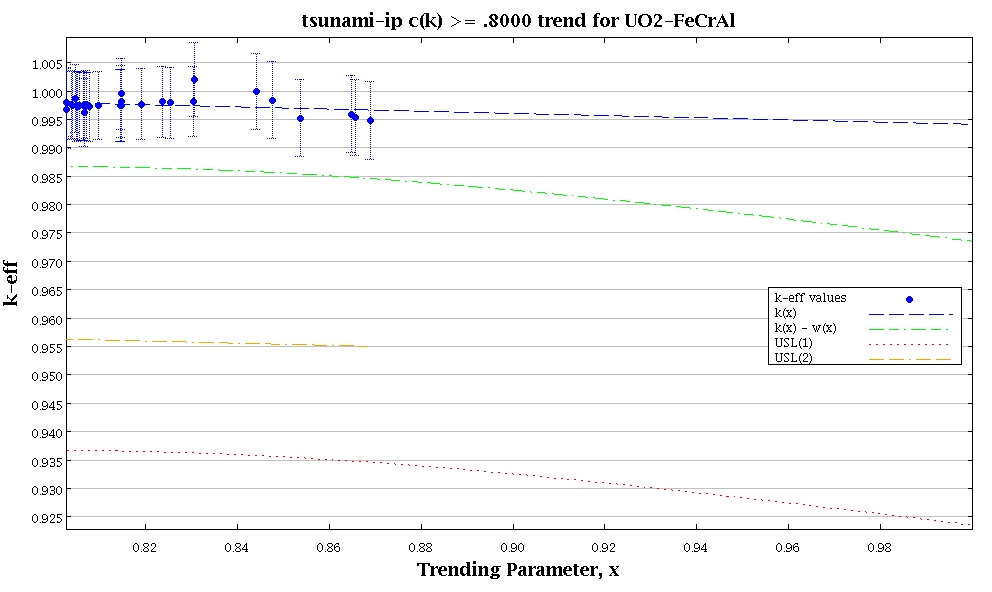
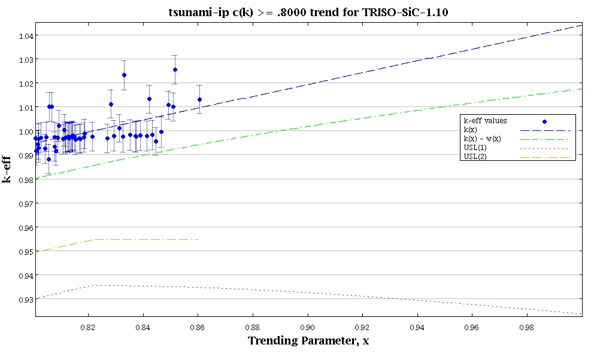
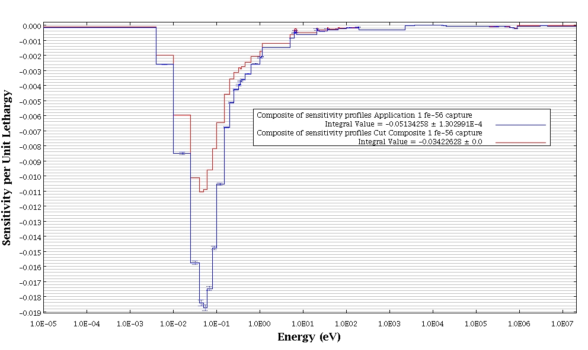
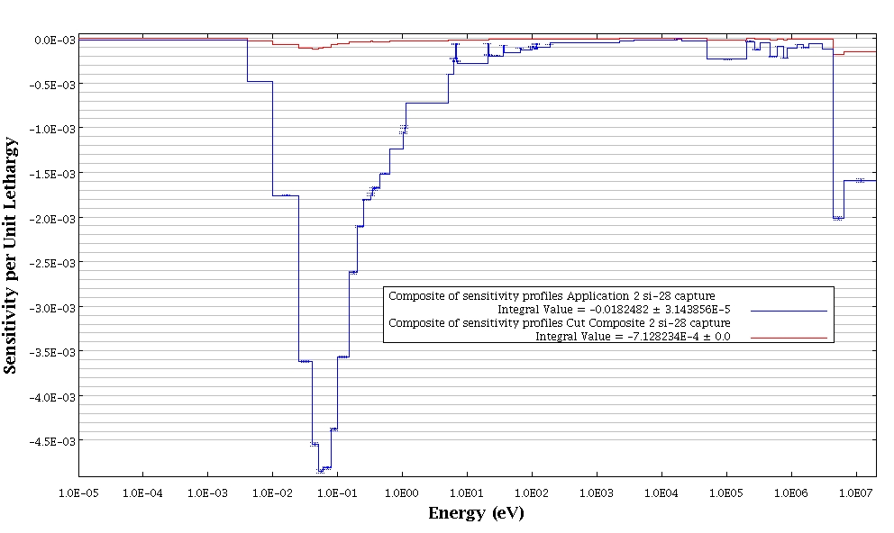

```{r setup, include=FALSE}
knitr::opts_chunk$set(echo = FALSE)
```

# Executive Summary

Licensing proposed ATF fuel concepts under the current regulatory framework of 10 CFR Part 50 with respect to criticality safety of SFP storage, while challenging, is not impossible. However, this will likely require the adoption of state-of-the-art criticality safety validation techniques, which may result in a significant reduction in operating margin.

# Introduction

The latest draft of the Accident Tolerant Fuel (ATF) action plan [@actionPlan"] identified Open Item 1 to assess the need for regulatory guidance to accommodate licensing ATF designs under the current regulatory framework. Related activities include determining/clarifying the regulatory criteria that need to be satisfied for partial/full core use of ATF and regulatory options available to licensees, applicants, and vendors. Table 2, "Regulatory Framework, In-reactor Performance," of the draft action plan identifies coated zirconium cladding and FeCrAl cladding as evolutionary ATF concepts, while silicon-carbide cladding, uranium silicide fuel, metallic fuel, and any fuel with greater than 5% enriched uranium as revolutionary concepts. Table 2 also notes that rulemaking or exemptions to 10 CFR 50.68 will be likely for designs containing uranium above 5 weight percent (wt%) uranium-235 (U-235).

The objective of this scoping study is to evaluate potential licensing challenges with respect to spent fuel pool (SFP) storage criticality safety reviews where 10 CFR 50.68 would typically be applicable (i.e., U-235 enrichment less than 5 wt%). Case studies considering both evolutionary and revolutionary candidate ATF fuel system design concepts currently being discussed in the open literature and exceeding 5 wt% U-235 enrichment are evaluated.

# Previous Research

In 2008, studies were conducted by the University of Tennessee to evaluate and extend the experimental basis for licensing 5-10 wt% U-235 nuclear reactor fuel [@gt5nmss]. The objective of the two-year project was to examine the need for critical experiments in the 5-10 wt% U-235 enrichment range in support of the licensing of nuclear reactor uranium fuel production. Because the focus of this research was the fuel production cycle (uranium hexfluoride gas container shipping, uranium dioxide powder production, uranium dioxide finished fuel pellet storage, and fuel reactor assembly cask shipping),[^1] and since the studies are limited to 10 wt% U-235 enrichment, the majority of the work is not necessarily directly applicable to SFP storage with the types of ATF fuel systems of interest in the present study.

[^1]: Modeled for both normal and contingency cases with varying fuel enrichments of 5%, 6%, 8% and 10%. In addition, late in the project a "damp powder" base case was identified and a preliminary analysis of this case was added to the scope.

## Experimental Benchmarks

The International Handbook of Evaluated Criticality Safety Benchmark Experiments (IHECSBE or "handbook") was used to identify potentially applicable evaluated benchmark experiments of interest. The majority of benchmark experiments contained in the handbook have corresponding sensitivity data files (SDFs) that are also included along with the handbook. The SDFs are output from SCALE/TSUNAMI-3D [@scale60] calculations of a modeled system of interest, and essentially contain experimental "signature" data that allows for comparison to other signature data based on a calculational model of the application of interest. Comparison of the SDF signature files, through the c~k~[^2] parameter allows for similarity assessment between experiment and application using a single integral parameter. A c~k~ value of 1 indicates perfect physical similarity and a value of 0 indicates no physical similarity [@ckprops0]. Therefore, use of the c~k~ parameater via SDFs allows for a convenient screening parameter to assess the availability of validation data for a given application. 

[^2]: Generated by the SCALE/TSUNAMI-IP sequence.

## Case Studies

Several calculational cases were defined and SDFs were generated by the researchers to represent the various applications of interest. The applicability of each of the experiments to each of the cases was evaluated based on the c~k~ parameter following previously published Oak Ridge National Laboratory (ORNL) guidance on recommended c~k~ screening values.

## Conclusions

Building on previous research, it was determined that experimental benchmark coverage would be deemed adequate as long as there were 25 experiments observed to have c~k~ greater than or equal to 0.80 or 15 experiments with c~k~ greater than or equal to 0.90. The researchers concluded that the evaluation indicates that existing experiments generally provide adequate coverage of the base cases examined stating:

> Five out of the seven configurations analyzed were shown to meet at least one of the criteria, leading to an assessment that they are adequately covered by the subset of experiments used. The two remaining cases--representing dry UF~6~ canisters at 5-10% ^235^U enrichment and bulk damp powder cases above about 8% ^235^U enrichment--are predicted to be adequately covered in true validation cases for which a more extensive subset of the existing critical experiments would be expected to be utilized.  This result depends heavily on the second criteria; most of the cases fail to identify enough experiments with ck > 0.90, so if this criterion becomes more important, the results of this project will have to be reevaluated.

# Current Research

It should be noted that the case study results discussed below are specific to those systems modeled and generalizations should not be made without careful thought. The intent of these scoping studies is to assess the need for better experimental coverage given the current snapshot of potential ATF fuel system concepts. These studies are also intended to illustrate a modern framework for criticality safety analysts to make informed decisions about criticality code validation when assessing new systems.

## Case Studies

As discussed in the ATF action plan, there is potential interest in pursuing greater than 5 wt% U-235 enriched fuel for some of the ATF fuel concepts. For the evolutionary concepts, this includes enrichments only slightly greater than 5 wt% U-235. As an example of an evolutionary fuel cladding, if iron-cromium-aluminum (FeCrAl) cladding is selected for use in a pressurized water reactor (PWR), this would require a U-235 wt% enrichment of approximately 5.4-6.3 wt% without having to significantly change fuel bundle design parameters such as fuel pin pitch or fuel pin outer diameter (OD) for the current standard 17x17 PWR fuel assembly (@fecral1; @fecral2).

A revolutionary concept could include much higher U-235 enrichments depending on the specific fuel pin design. One example that appears frequently in the open literature is the fully ceramic micro-encapsulated (FCM) fuel concept, which consists of TRISO particles dispersed in a silicon-carbide (SiC) matrix to form fuel pellets. The TRISO particles themselves could contain a variety of uranium-based fuels, but in this example, uranium silicide is selected as it is a candidate fuel discussed in the ATF action plan. For this same reason, the SiC based FCM fuel design was selected. In this case, in order to maintain the current standard 17x17 PWR fuel assembly dimensions, as with the previous case, the U-235 enrichment must be allowed to vary. However, to compensate for the fact that the heavy metal loading of FCM fuel is realtively low due to the TRISO particles having a packing fraction of about 45%, the pin OD must also be able to be varied. This is mechanically possible for a current standard 17x17 PWR fuel assembly assuming a pin OD of about 1.1 cm, however this also requires a U-235 enrichment of almost 20% [@fecral2].

### Models

As with the previous research, application-specific TSUNAMI-3D models were created. In the current study, two semi-infinite (assuming no axial effects) TSUNAMI-3D models were created simulating a SFP environment using SCALE 6.2. The basic characteristics include a 17x17 PWR fuel assembly with the selected ATF concept surrounded by a conventional stainless steel storage rack structure. The models (somewhat arbitrarily)[^10] assume no fixed neutron absorber material (NAM) as part of the rack and water with 1000 parts per million (ppm) of soluble boron.

[^10]: While arbitrary, a multiple misloaded fresh fuel assembly in a region with degraded fixed NAM is a credible accident [@IN201409]. Furthermore, to mitigate this accident, soluble boron is likely to be required.

After the two TSUNAMI-3D models were run, SDF files were output for use with TSUNAMI-IP. The k~inf~ of the uranium dioxide (UO~2~) (5.86 wt% U-235) with FeCrAl cladding case was observed to be ~1.24, which is similar to an expected conventional peak light water reactor fuel lattice k~inf~ [@epri2017]. The k~inf~ of the uranium silicide (U~3~Si~2~) (20 wt% U-235) in a SiC matrix with SiC cladding case was observed to be ~1.48, which is close to what is expected for this type of fuel in the conventional PWR fuel assembly geometry [@kinfFCM].

### Experimental Benchmarks

Since the previous 2008 study was conducted, there have been several updates to the IHECSBE handbook. Although many potentially useful experiments have been added since 2008,[^11] the corresponding SDFs have not been included with distribution of the handbook, and therefore unfortunately have not been included in this study. Needless to say, future development of TSUNAMI-3D models for these experimental series may be useful to support greater than 5 wt% U-235 enrichment validation studies related to ATF fuel concepts.

[^11]: LEU-COMP-THERM-096: Partially-reflected water-moderated square-pitched U(**6.90**)O~2~ fuel rod lattices with 0.67 fuel to water volume ratio (0.800 cm pitch) added in 2015 [@handbook15]; LEU-COMP-THERM-097: Titanium and/or aluminum rod-replacement experiments in fully-reflected water-moderated square-pitched U(**6.90**)O~2~ fuel rod lattices with 0.67 fuel to water volume ratio (0.800 cm pitch) added in 2016 [@handbook16]. LEU-COMP-THERM-098: Moderator-controlled critical experiments with UO~2~-**5.74** wt% U-235 fuel rods added in 2018 [@handbook18].

As with previous research, TSUNAMI-IP was run with the two ATF fuel concept case studies as the applications of interest. The SDFs corresponding to the benchmark experiments provided as part of the latest release of the handbook were used as the experiments to be used for c~k~ screening. Although 4316 SDFs were included with the handbook, only 3984 were found to work with TSUNAMI-IP -- likely due to formatting errors. Nonetheless, running TSUNAMI-IP for the two ATF fuel concept applications resulted in 31[^50] experiments with a c~k~ greater than or equal to 0.80 for the UO~2~-FeCrAl case and 56[^51] experiments with a c~k~ greater than or equal to 0.80 for the FCM-SiC case. Although this indicates that there are relatively few publicly available benchmark experiments that are relevant to the selected ATF fuel concepts in the context of the theoretical SFP criticality safety analysis being performed, the criteria defined in the previous study that greater than 25 experiments with a c~k~ of greater than or equal to 0.80 should be used as a minimum experimental validation set has been met. It is likely that future consideration of LEU-COMP-THERM-096, LEU-COMP-THERM-097, and LEU-COMP-THERM-098 would increase the number of applicable experiments.

[^50]: All from LEU-COMP-THERM-008, LEU-COMP-THERM-047, LEU-COMP-THERM-051, LEU-COMP-THERM-055, and LEU-COMP-THERM-076.

[^51]: All from LEU-COMP-THERM-008, LEU-COMP-THERM-011, LEU-COMP-THERM-014, LEU-COMP-THERM-028, LEU-COMP-THERM-047, LEU-COMP-THERM-051, LEU-COMP-THERM-076, LEU-COMP-THERM-081, and HEU-SOL-THERM-044. Given that the HEU-SOL-THERM-044-011 experiment, with a c~k~ of 0.8605, had the highest c~k~ among any of the 56 experiments in the validation set, it is not clear what the implications of this observation are as this experiment contains highly enriched uranyl nitrate (U-235 wt% of 93.172) solution -- much greater than the 20 wt% U-235 in the application. That is, what would be the arguments for not allowing this experiment to be included in the validation set given the greater enrichment and the extraneous materials such as nitrogen? It would seem that as long as the most important reactions -- those related to U-235 in this case -- are covered by the experiment, and the sensitivity (and/or corresponding nuclear data uncertainty) of extraneous materials in the questionable experiment have a negligible impact, then the experiment should be allowed in the validation set.

It is notable that in the current study, the number of experiments exceeding a c~k~ of 0.90 is zero, whereas in the previous 2008 study, several were found for the similar flooded transport cask cases (although this case did not contain soluble boron). Furthermore, hundreds of experiments were found exceeding a c~k~ of 0.80 for the flooded transport cask cases. A potential cause of the significant reduction in number of applicable critical experiments across relatively similar applications studied in 2008 and now in 2018 could be due to over-estimation of c~k~ due to lower fidelity nuclear covariance libraries used in the earlier versions of SCALE [@covarianceEffects]. The main implication, however, is that the previous 2008 study should be re-evaluated using the latest nuclear data as experimental coverage conclusions may change. Nevertheless, the same c~k~ evaluation guidelines remain valuable and were used in the present study to assess experimental benchmark coverage for SFP storage of potential greater than 5 wt% U-235 ATF fuel system concepts. It is also noted that SCALE Version 6.2 [@scale62] is used in the current study, which contains the highest fidelity covariance data available to-date.[^12]

[^12]: New covariance data based on ENDF/B-VIII.0 is already available for consideration in a future SCALE release [@brown2018endf].

### c~k~ Trending

Traditional validation techniques (see Section 6.1 of NUREG/CR-7109) may be used, but require significant engineering judgment [@cr7109]. c~k~ trending is preferable as it is an objective method based on the physical application under consideration and removes engineering judgment. Specifically, the idea is to make sure that the experimental validation set is weighted by those experiments with the largest important sources of uncertainty for the application of interest. Therefore, any bias and bias uncertainty derived from these experiments should allow for the most physically representative bias possible based on the experiments available assuming that nuclear data uncertainties are expected to dominate any true computational bias and bias uncertainty.

c~k~ trending has been documented in NUREG/CR-7109 (see discussion on pg. 19 and Section 7.4.2). It is noted that NUREG/CR-7109 recommends c~k~ trending only if there are a significant number of experiments with c~k~ values greater than or equal to 0.90 because "the interpolation would be over too large a range". However, relaxation of this criterion to 0.80 is a compromise between using traditional trending techniques involving significant engineering judgment and the more physically-based c~k~ trending method. In other words, while this may provide for more interpolation than is desirable, it is still a more physically comprehensive method than using engineering judgment to pick relevant individual parameters, which are by definition less comprehensive, to trend on. 

#### UO~2~ (5.86 wt% U-235) with FeCrAl Cladding

It is important to note that the underlying benchmark experiment data with c~k~ greater than or equal to 0.80 summarized in the histogram below did not pass the Chi-Squared test for normality.

```{r}
experimentalKeff <- c(0.9974,0.9976,0.9987,0.9962,0.9974,0.9980,0.9974,0.9973,0.9974,0.9976,0.9975,0.9972,0.9972,0.9976,0.9995,0.9982,0.9979,0.9981,0.9975,0.9982,0.9977,0.9979,0.9975,0.9967,0.9952,0.9953,0.9959,0.9948,0.9999,0.9984,1.0020)

hist(experimentalKeff)
```

This makes any trending analysis questionable. The data in this case is seen to be excessively peaked around ~0.998. Additionally, it is noted that there are a relatively few number of measurements, which can be problematic for normality testing. Finally, upon visual observation of the data, there aren't any obvious features that would imply that assuming normality would be problematic in terms of non-conservatively biasing uncertainty estimates. In this case, the data will be treated as normal for the sake of discussion.[^20]

[^20]: Alternative, non-parametric methods are discussed in NUREG/CR-6698 [@cr6698]. It's also worth mentioning that the correlation between experiments needs to be considered when performing a regression analysis [@sobes2015upper]. For example, if the majority of the experiments come from the same experimental series, this data dependency (i.e., lack of independence) causes a certain amount of information loss that could significantly increase the bias uncertainty.



At the trending parameter (i.e., c~k~) value of 1, the average experimental k~eff~, denoted by the "k(x)" curve, is observed to extrapolate to less than 1, which is indicative of a k~eff~ underprediction bias. Therefore, this difference between k~eff~ equal to 1 and the average experimental k~eff~ would be accounted for as part of the criticality safety analysis validation. In this case, the bias was determined to be `r (1-0.9941480)*1e5` pcm. The corresponding uncertainty based on the single sided lower tolerance limit, denoted by the "k(x) - w(x)" curve, is `r (0.9941480-0.9735310)*1e5` pcm.

#### U~3~Si~2~ (20 wt% U-235) in a SiC Matrix with SiC Cladding

Again, it is important to note that the underlying data shown did not pass the Chi-Squared test for normality, and the same conclusions apply and are not repeated. It is noted that one difference in this case is an apparent skewness in the data, which could be a significant feature that would warrant further inspection -- especially since the data is skewed in the non-conservative prediction direction (i.e., k~eff~ overestimation).

```{r}
experimentalKeff <- c(1.0132E0,1.01E0,1.0255E0,1.0231E0,1.0111E0,1.0107E0,1.0099E0,1.0131E0,1.01E0,9.9560E-1,1.002E0,9.9290E-1,9.9340E-1,9.9160E-1,9.9170E-1,9.8820E-1,9.9250E-1,9.9430E-1,9.9680E-1,9.9750E-1,9.9790E-1,9.9770E-1,9.9820E-1,9.9750E-1,9.9810E-1,9.9790E-1,9.9820E-1,1.0002E0,9.9950E-1,9.970E-1,1.0011E0,9.9710E-1,9.9740E-1,9.970E-1,9.9710E-1,9.9650E-1,9.9760E-1,9.9690E-1,9.9660E-1,9.9680E-1,9.9760E-1,9.9720E-1,9.9720E-1,9.9750E-1,9.9760E-1,9.9740E-1,9.9730E-1,9.9660E-1,9.9680E-1,9.9740E-1,9.980E-1,9.9740E-1,9.9620E-1,9.9870E-1,9.9760E-1,9.9740E-1)

hist(experimentalKeff)
```



Repeating the same exercise as with the previous case, the average experimental k~eff~ at a c~k~ value of 1 is observed to extrapolate to greater than 1, which is indicative of a k~eff~ overprediction bias. Since it is typical to not credit overprediction bias in criticality safety analysis validation [@ans824], the bias would be reported as 0 pcm. However, the bias uncertainty is still included and is observed to be `r (1.04382-1.01748)*1e5` pcm.

#### Notes on Generalized Linear Least-Squares Method (GLLSM) Bias and Bias Uncertainty Estimates

Based on the c~k~ trending results in the preceding subsection, one might argue that there should be more relevant experiments (i.e., more experiments in general; more/some with c~k~ greater than 0.90; more at higher enrichments) in support of the validation effort. However, if fuel systems used in commercial nuclear power plants do actually evolve into those similar to the ones being considered in this study, the criticality safety community will most certainly encounter shortages of relevant criticality safety experiments for users' specific applications.

Recent research also provides limited evidence that use of c~k~ trending using too few experiments could lead to a decrease in an ability to reliably predict bias estimates [@perfetti2018estimating]. The same research indicates that a GLLSM, like the one implemented in the SCALE/TSURFER tool, could provide a means for more reliable bias estimates based on the observation that the standard deviation of the TSURFER bias estimates was lower than that from the c~k~ trending bias estimates; however, this will require additional study.

It is also important to note that use of TSURFER for criticality code validation is attractive because the GLLSM implemented in TSURFER does not rely upon the availability of highly similar experiments to estimate computational bias for a given application. Additionally, recent research has addressed many of the concerns raised regarding use of codes like TSURFER for validation making them even more attractive [@perfetti2018ensuring].[^13]

[^13]: Use of TSURFER for criticality code validation for burnup credit applications has also been previously discussed in NUREG/CR-7109.

### Experimental Benchmark Coverage

#### UO~2~ (5.86 wt% U-235) with FeCrAl Cladding

Based on TSUNAMI-IP analysis, the total relative standard deviation of k~eff~ due to uncovered sensitivity data is ~100 pcm/k. Studies have shown that using three times this relative standard deviation (3-sigma) applied as a bias may provide for a conservative "coverage penalty" [@cr7109].

The dominant sources of lack of coverage (i.e., ~95%), which dominate the coverage penalty, come from two reactions: the Fe-56 (n, gamma) capture reaction and the U-238 (n, n') reaction. Therefore, one could conclude that additional experiments to better cover these two reactions would significantly increase overall experimental coverage leading to experiments with higher c~k~s and less of a coverage penalty.



Two sensitivity profiles are shown in the figure above for the reaction contributing most to the coverage penalty. In this case it is clear that there aren't sufficient benchmark experiments containing Fe-56 sensitive to the thermal region of the spectrum between 0.01 and 0.1 eV.

The SCALE manual also describes the TSUNAMI-IP completeness parameter, which can be used to:

> Assess the completeness of a set of experiments for the code validation of a given application. The set of experiments is "complete" in the sense that it completely tests all the important cross-section elements in the particular application of interest.

For the UO~2~-FeCrAl cladding case study, the completeness parameter was determined to be 0.7761 based on the 31 handbook benchmark experiments exceeding or equal to a c~k~ value of 0.80. This single summary parameter is therefore useful to gauge general experimental coverage and can serve as a guide to code practitioners as to whether or not more and/or better experiments should be considered.

#### U~3~Si~2~ (20 wt% U-235) in a SiC Matrix with SiC Cladding

Based on TSUNAMI-IP analysis, the total relative standard deviation of k~eff~ due to uncovered sensitivity data is again ~100 pcm/k. However, the absolute impact is larger because k~eff~ is larger for this system versus the UO~2~-FeCrAl system (i.e, ~1.48 vs. ~1.24, respectively), and consequently the coverage penalty would be larger (i.e., ~450 pcm vs. ~375 pcm). In this case, the dominant sources of lack of coverage (i.e., ~95%) come from four reactions: Si-28 (n, gamma), Si-28 (n, p), Si-30 (n, gamma), and Si-28 (elastic). 



Two sensitivity profiles are shown in the figure above for the reaction contributing most to the coverage penalty. In this case it is clear that there aren't sufficient benchmark experiments containing Si-28 sensitive to the thermal region of the spectrum between 0.01 and 10 eV and for parts of the fast region for energies greater than ~5 MeV.

For this case the completeness parameter was determined to be 0.7726 based on the 56 handbook benchmark experiments exceeding or equal to a c~k~ value of 0.80. As before, one could conclude that additional experiments to better cover these four reactions would significantly increase overall experimental coverage leading to experiments with higher c~k~s and less of a coverage penalty.

## Conclusions

Using the TSUNAMI tools (or tools like them), the following high level strategy could be used for criticality code validation based on adequate experimental coverage:

1. Perform c~k~ trending analysis.[^5] Determine code bias and bias uncertainty at c~k~ = 1 if using the single sided lower tolerance limit approach. 

2. Determine an appropriate coverage penalty.[^6]

3. If Step 1 is unfeasible (or excessively conservative) or the coverage penalty is determined to be too large (or excessively conservative), determine the TSUNAMI-IP completeness parameter. Try and find more applicable experiments, re-run TSUNAMI-IP incorporating any newly identified experiments, and verify an increase in the completeness parameter. Return to Step 1. If no additional experiments can be found or Step 1 remains unfeasible, use two to three times the problem-specific nuclear data uncertainty, applied as a bias, to conservatively bound the code bias and bias uncertainty (see pg. 13 of NUREG/CR-7109).

[^5]: Assuming a sufficient number of experiments exists with c~k~ greater than or equal to 0.80. The single sided lower tolerance limit (among others), documented in NUREG/CR-6698, can be used, and can also be determined automatically by SCALE/USLSTATS via TSUNAMI-IP.

[^6]: Two to three times the total relative standard deviation of k~eff~ due to uncovered sensitivity data could be used.

# Final Thoughts

This scoping study indicated that there are experimental benchmark data and advanced analysis tools that could allow for defensible criticality code validation for a variety of evolutionary and revolutionary ATF fuel systems. Since criticality code validation is very problem-specific, licensees, applicants, and vendors will need to conduct their own studies to support ATF licensing (e.g., if seeking an exemption from 10 CFR 50.68 due to use of greater than 5 wt% U-235 enrichment). It is also likely that these studies will also include credit for the reactivity decrease associated with depleted fuel (known as burnup credit), which introduces the added complexity of having to validate minor actinides and fission products. However, use of the TSUNAMI and TSURFER tools and other tools like them, have been effectively used to overcome validation challenges and it is foreseen that this will continue as nuclear fuel systems evolve and outpace the creation of additional and costly relevant critical benchmark experiments. 
